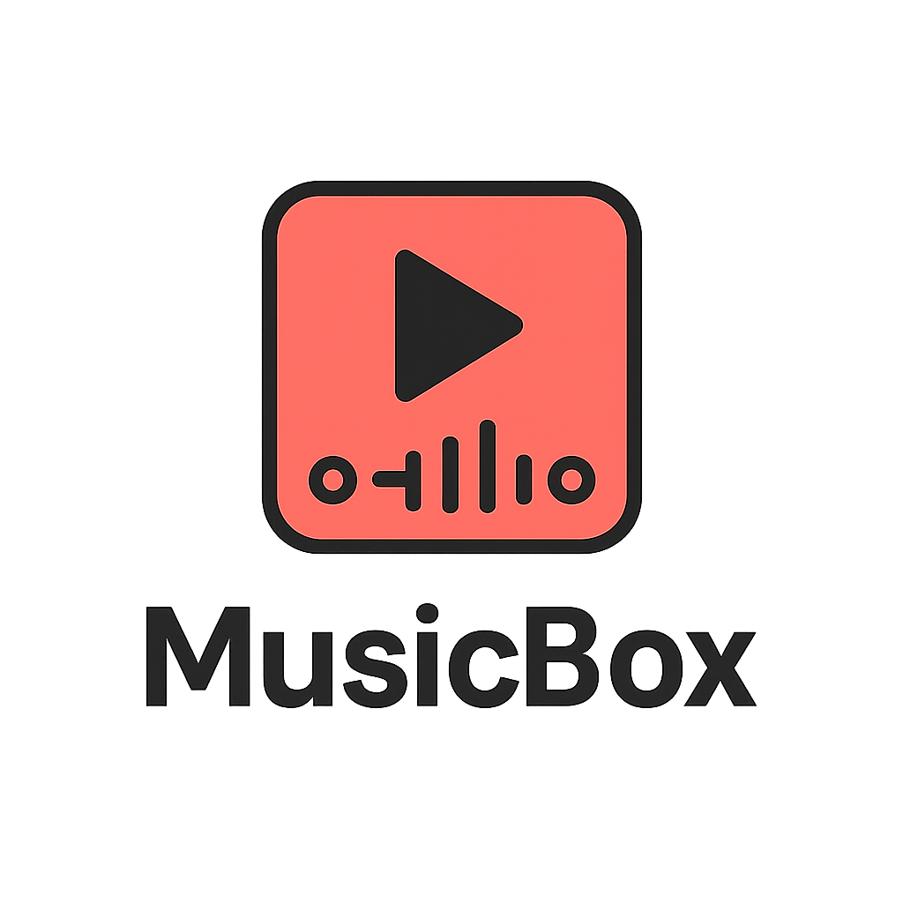

<div align="center">
   <picture>
      <source media="(prefers-color-scheme: dark)" srcset="assets/musicbox-logo-light.png">
      <source media="(prefers-color-scheme: light)" srcset="assets/musicbox-logo-dark.png">
      
   </picture>   

   [](https://angular.io/)
   [](https://www.djangoproject.com/)
</div>

Welcome to **MusicBox** – the ultimate web application that lets you dive into your favorite tunes! Built with a robust **Angular** frontend and a powerful **Django** backend, MusicBox provides you with a seamless music streaming and management experience. Enjoy creating and managing your playlists, exploring artists, and discovering albums and songs from your beloved music artists.

## Table of Contents

- [Features](#features)
- [Tech Stack](#tech-stack)
- [Installation](#installation)
- [Usage](#usage)
- [Project Structure](#project-structure)
- [Contributors](#contributors)

## Features

- **User Authentication:** Secure registration and login system.
- **Playlist Management:** Create, edit, and manage your personalized playlists.
- **Music Streaming:** Listen to high-quality music seamlessly.
- **Artist Profiles:** Access detailed information about your favorite artists.
- **Albums & Songs:** Browse through artists’ albums and songs with ease.
- **Responsive Design:** Fully responsive UI for a smooth experience on all devices.

## Tech Stack

- **Frontend:** Angular
- **Backend:** Django
- **Database:** PostgreSQL
- **Authentication:** JWT & Session-based Authentication

## Installation

### Prerequisites

- [Node.js](https://nodejs.org/)
- [Angular CLI](https://angular.io/cli)
- [Python 3.8+](https://www.python.org/downloads/)
- [Django](https://www.djangoproject.com/)
- [PostgreSQL](https://www.postgresql.org/) 

### Setup Instructions

1. **Clone the repository:**
   ```bash
   https://github.com/unkn0t/music-box.git
   cd music-box
   ```
   
2.  **Frontend Setup (Angular):**
    ```bash
    cd frontend/musicbox
    npm install
    ng serve  
    ```
    
    Open your browser at [http://localhost:4200](http://localhost:4200)
    
3.  **Backend Setup (Django):**
    ```bash
    cd backend
    python -m venv .venv
    source .venv/bin/activate  # For Windows use: .venv\Scripts\activate
    pip install -r requirements.txt
    python manage.py migrate
    python manage.py runserver
    ```
    
    Access the backend at [http://localhost:8000](http://localhost:8000)
    

## Usage

-   **Register/Login:** Create an account or log in to access all features.
    
-   **Manage Playlists:** Create new playlists or manage existing ones.
    
-   **Listen to Music:** Stream your favorite tracks directly from the web.
    
-   **Explore Artists:** View artist profiles and check out their albums and songs.
    

Feel free to explore and experiment – MusicBox is designed to make your musical journey enjoyable and personalized!

## Project Structure

```
music-box
├── backend
│   ├── manage.py
│   ├── musicbox
│   └── requirements.txt
├── frontend
│   └── musicbox
│       ├── angular.json
│       ├── package.json
│       └── src
└── README.md
```

## Contributors

-   **Innokentiy Popov** - _Initial work_ - [GitHub](https://github.com/unkn0t)
    
-   **Contributor Name** - _Backend Development_ - [GitHub](https://github.com/username)
    
-   **Contributor Name** - _Frontend Development_ - [GitHub](https://github.com/username)
    
-   **Contributor Name** - _Design & UX_ - [GitHub](https://github.com/username)
    

----------
